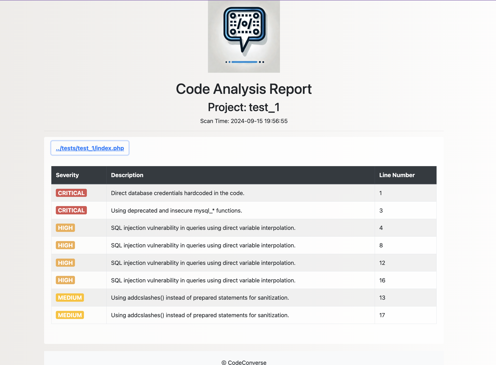

# CodeConverse

<div align="center">
  

  [![GitHub Release][release-img]][release]
  [![Build Status][build-img]][build]
  [![License: MIT][license-img]][license]
  [![GitHub Issues][issues-img]][issues]
  [](https://sonarcloud.io/summary/new_code?id=Bagautdino_CodeConverse)
  [](https://sonarcloud.io/summary/new_code?id=Bagautdino_CodeConverse)
  

</div>

**CodeConverse** is an advanced AI-powered Static Application Security Testing (SAST) tool that leverages the GROQ API to detect vulnerabilities, secrets, and code quality issues in your source code. It supports multiple programming languages and generates comprehensive HTML reports, streamlining your vulnerability assessment process.

---

## Table of Contents

- [Features](#features)
- [Supported Languages](#supported-languages)
- [Quick Start](#quick-start)
  - [Installation](#installation)
    - [Local Installation](#local-installation)
    - [Docker Usage](#docker-usage)
  - [Configuration](#configuration)
- [Usage](#usage)
  - [Command-Line Arguments](#command-line-arguments)
  - [Examples](#examples)
- [Reports](#reports)
- [Logging](#logging)
- [Architecture](#architecture)
- [Limitations](#limitations)
---

## Features

- **AI-Powered Analysis**: Utilize the GROQ API for advanced static code analysis.
- **Multi-Language Support**: Analyze code written in Python, JavaScript, Java, C/C++, C#, and TypeScript.
- **Detailed Reports**: Generate comprehensive HTML reports with severity levels, issue descriptions, and line numbers.
- **Customizable Settings**: Configure analysis parameters such as retries, timeouts, and logging levels.
- **Easy Integration**: Run locally or integrate into CI/CD pipelines using Docker.

---

## Supported Languages

CodeConverse can analyze source code files with the following extensions:

- **Python**: `.py`
- **JavaScript**: `.js`
- **Java**: `.java`
- **C/C++**: `.c`, `.cpp`
- **C#**: `.cs`
- **TypeScript**: `.ts`

For a complete list of supported languages and file types, see the [Scanning Coverage](#supported-languages) section.

---

## Quick Start

### Installation

#### Local Installation

1. **Clone the Repository**

   ```bash
   git clone https://github.com/Bagautdino/CodeConverse.git
   cd CodeConverse
   ```

2. **Create a Virtual Environment (Optional but Recommended)**

   ```bash
   python -m venv venv
   source venv/bin/activate  # On Windows use: venv\Scripts\activate
   ```

3. **Install Dependencies**

   ```bash
   pip install -r requirements.txt
   ```

#### Docker Usage

Pull the Docker image to integrate CodeConverse into your CI/CD pipeline:

```bash
docker pull ayvazbudapeshtov/code_converse:1.1.2
```

---

### Configuration

Before running CodeConverse, set up your API configuration.

#### Setting Up Environment Variables

It's recommended to use environment variables for sensitive information like API tokens.

1. **Set the GROQ API Key**

   ```bash
   export GROQ_API_KEY="your_groq_api_key"
   ```

2. **Set Additional API Tokens (If Required)**

   ```bash
   export GROQ_API_TOKENS="token1,token2,token3"
   ```

Alternatively, you can create a `config.py` file in the `analyzer` directory:

```python
# analyzer/config.py

import os

tokens = os.getenv("GROQ_API_TOKENS", "").split(",")
GROQ_API_KEY = os.getenv("GROQ_API_KEY")
```

---

## Usage

Run CodeConverse using the `main.py` script or the Docker image.

### Command-Line Arguments

- **`directory`**: Path to the source code directory (default: current directory `.`).
- **`--output`**: Filename for the HTML report (default: `report.html`).
- **`--max-retries`**: Max attempts for API requests (default: `5`).
- **`--timeout`**: Timeout for API requests in seconds (default: `20.0`).
- **`--log-level`**: Logging level (`DEBUG`, `INFO`, `WARNING`, `ERROR`, `CRITICAL`) (default: `INFO`).

### Examples

- **Analyze a Specific Directory**

  ```bash
  python main.py /path/to/your/project --output my_report.html --log-level DEBUG
  ```

- **Analyze the Current Directory**

  ```bash
  python main.py
  ```

- **Using Docker**

  ```bash
  docker run -v /path/to/your/project:/app/project ayvazbudapeshtov/code_converse:1.1.2 python main.py /app/project
  ```

---

## Reports

Generated reports are in HTML format, providing:

- **Project Name**: Automatically extracted from the directory name.
- **Scan Time**: Timestamp of when the scan was performed.
- **Detailed Issues**: Severity levels, descriptions, and line numbers.
- **Interactive Elements**: Collapsible sections for each file and color-coded severity levels.

### Sample Report

<details>
<summary>Click to view sample report screenshot</summary>



</details>

---

## Logging

CodeConverse supports multiple logging levels:

- **DEBUG**: Detailed debugging information.
- **INFO**: General events and milestones.
- **WARNING**: Indications of potential issues.
- **ERROR**: Errors that occurred during execution.
- **CRITICAL**: Severe errors causing premature termination.

Logs are written to both the console and a log file (`code_analyzer.log`).

---

## Architecture

CodeConverse is modular, consisting of:

- **`CodeAnalyzer`**: Scans files, interacts with the GROQ API, and processes analysis results.
- **`HTMLReport`**: Generates comprehensive HTML reports using Jinja2 templates.
- **`config.py`**: Manages configuration settings and API tokens.
- **`main.py`**: Entry point script handling argument parsing and orchestrating the analysis.

---

## Limitations

- **Internet Connection Required**: Necessary for accessing the GROQ API.
- **API Rate Limits**: Subject to GROQ API rate limits; retries are handled automatically.
- **Code Size Limitations**: Files are split into 5000-character chunks due to API constraints.
- **Language Support**: Limited to specified programming languages.

---

[release]: https://github.com/Bagautdino/CodeConverse/releases
[release-img]: https://img.shields.io/github/release/Bagautdino/CodeConverse.svg?logo=github
[build]: https://github.com/Bagautdino/CodeConverse/actions/workflows/build-sign-push.yml
[build-img]: https://github.com/Bagautdino/CodeConverse/actions/workflows/build-sign-push.yml/badge.svg?branch=master
[license]: https://github.com/Bagautdino/CodeConverse/blob/master/LICENSE
[license-img]: https://img.shields.io/badge/License-Apache%20License-blue.svg
[issues]: https://github.com/Bagautdino/CodeConverse/issues
[issues-img]: https://img.shields.io/github/issues/Bagautdino/CodeConverse.svg
[docs]: https://github.com/Bagautdino/CodeConverse/wiki
[discussions]: https://github.com/Bagautdino/CodeConverse/discussions
[code-of-conduct]: https://github.com/Bagautdino/CodeConverse/blob/master/CODE_OF_CONDUCT.md
