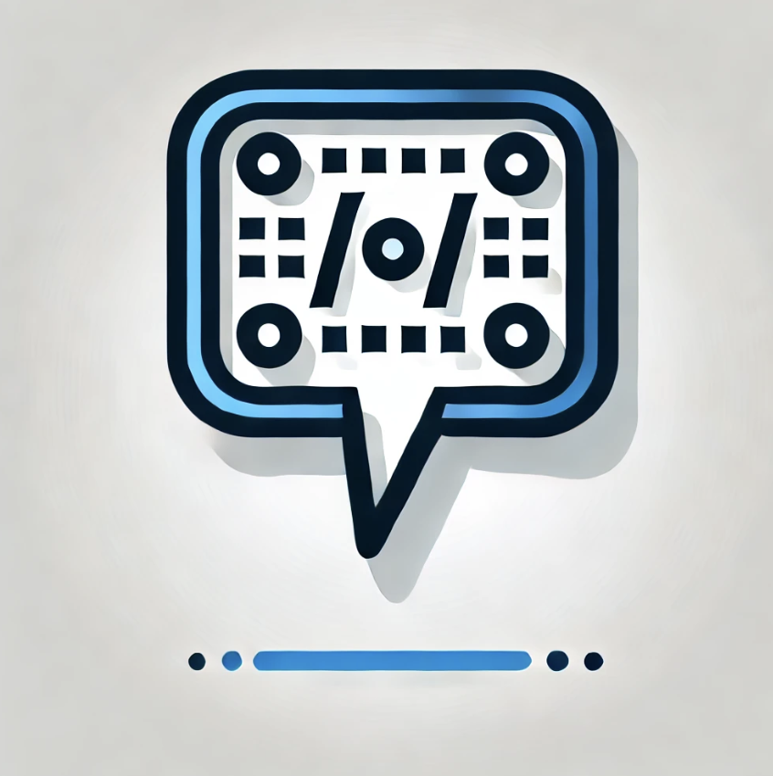

# CodeConverse

**CodeConverse** is a cutting-edge code analysis tool that leverages the GROQ API to detect vulnerabilities and generate concise HTML reports. It supports a variety of programming languages and streamlines the vulnerability assessment process.

## Supported File Types

CodeConverse can analyze source code files in the following languages:

- Python: `.py`
- JavaScript: `.js`
- Java: `.java`
- C/C++: `.cpp`, `.c`
- C#: `.cs`
- TypeScript: `.ts`

## Reports

Generated reports are in HTML format for easy viewing in web browsers.

## Configuration

Ensure that your API configuration is set up correctly before launching the program. API tokens should be defined in `config.py`.

### Example Configuration (`config.py`):

    tokens = [
        # List of API tokens
    ]

    GROQ_API_KEY = "GROQ_API_KEY"  # include via environment variables

## Getting Started

### Prerequisites

- Python 3.x
- Access to the GROQ API

### Local Installation

Clone the repository and install dependencies:

    git clone https://github.com/yourusername/CodeConverse.git
    cd CodeConverse
    pip install -r requirements.txt

### Docker Usage

Create a job for GitHub Actions or GitLab CI using the Docker image:

    ayvazbudapeshtov/ai-sast-tool:1.0.0

### Usage

To start analyzing code:

    python main.py /path/to/source/code --output report.html --log-level INFO

### Command-Line Arguments

- `directory`: Path to the source code directory.
- `--output`: Filename for the HTML report. Default is `report.html`.
- `--max-retries`: Max attempts for API requests. Default is `5`.
- `--timeout`: Timeout for API requests in seconds. Default is `20.0`.
- `--log-level`: Logging level (`DEBUG`, `INFO`, `WARNING`, `ERROR`, `CRITICAL`). Default is `INFO`.

### Example

Analyze the `src/` directory with debug logging and save the report to `vulnerability_report.html`:

    python main.py src/ --output vulnerability_report.html --log-level DEBUG

## Logging

CodeConverse supports multiple logging levels for detailed diagnostics:

- `DEBUG`: Detailed debugging information.
- `INFO`: Key events and results.
- `WARNING`: Potential issues.
- `ERROR`: Runtime errors.
- `CRITICAL`: Critical issues.

Logs are output to the console by default.

## Architecture

The program is modular, comprising:

- **Analyzer**: Processes files and interfaces with the API.
- **HTMLReport**: Generates HTML format reports.
- **Config**: Manages configuration data.

This modular design facilitates future expansions and modifications.

## Limitations

- Internet connection is required for API access.
- There is a limit on the size of code per request; code is segmented into 5000-character blocks for API processing.
